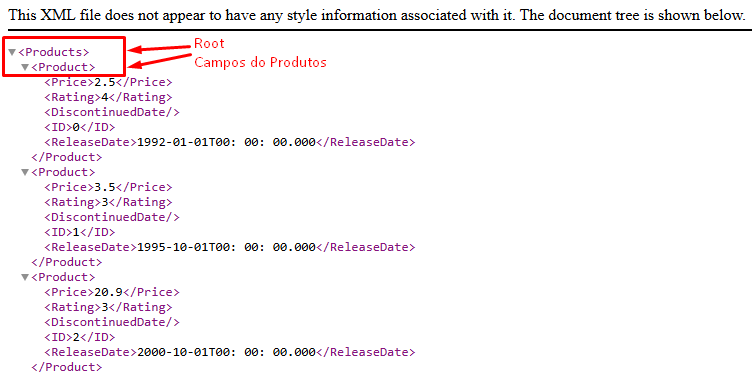
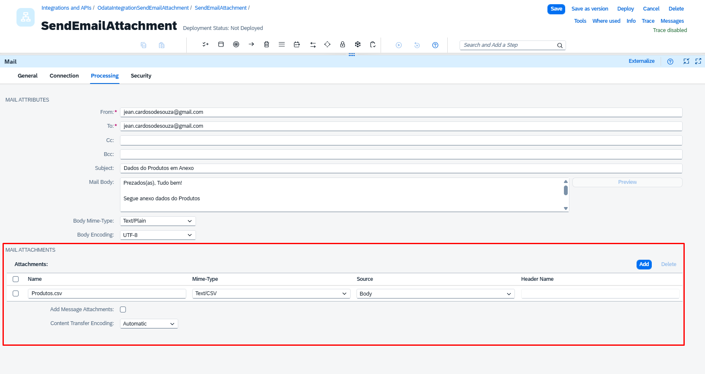
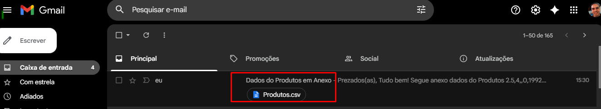

# Buscando Produtos Odata é convertendo em CSV e Enviando no Email Anexo
SAP BTP CPI - Send Email Attachement

## Buscando OData e enviando com Anexo no E-Mail

Este iFlow foi desenvolvido no SAP BTP – Integration Suite (Cloud Integration) com o objetivo de extrair dados de produtos a partir de um serviço OData, converter essas informações para o formato CSV e enviar o arquivo como anexo por e-mail de forma automática.

Esse cenário é muito comum em integrações onde é necessário distribuir dados para áreas de negócio, auditoria, relatórios ou integrações legadas que consomem arquivos CSV.


📊 Exemplo Prático do Fluxo

### Acessando o E-mail no GMAIL
https://myaccount.google.com/apppasswords


### APP menos Seguro no GMAIL


### Armazenando a senha do APP


### Criando nosso Manage Security
Em Monitor -> Integrations and APIs -> Vamos em Security Material


### Criar nossas credenciais


### Criando nosso usuários


### Testando nossas credenciais no GMAIL
Podemos testar nossas configurações em Em Monitor -> Integrations and APIs -> Vamos em Security Material -> Connectivity Tests


### Testando o Gmail


### Criando nosso Pacote


### Adicionando o nome para nosso Pacote


### Criando nosso Artefato do iFlow


### Adicionando o Integration Flow


### Editando nosso Iflow


### Removendo o Start
Não vamos precisar do Start nesse momento, vamos adicionar o Timer mais para frente.


### Adicionadno um Timer
https://services.odata.org/V2/


### Conectar o Timer no End


### Renomeando o Receiver para OData


### Adicionando o Request Replay


### Conectando o Request Replay no Receiver OData


### Selecionando o OData


### Selecionando o OData V2 


### Acessando a página do OData para (Ler-Escrever)
https://services.odata.org/V2


### Usuário criado do OData V2


### Configurando o OData V2 - Conection


### Configurando o OData V2 - Processing


### Conectando Sistema do OData V2


### Configurando o e Definindo Operações do OData V2
Selecionamos o GET


### Selecionando o Products 


### Marcando para gerar o XML Schema e todos Fields


### No Conector vamos adicinar o XML para CSV


### Transformar o XML para CSV


### Renomeando o XML to CSV Converter


### Definindo o caminho que vai ser convertido no XML para CSV


### Como indentificar o Path no XML


### Removendo o Sender
Não vamos utilizar ele nesse exemplo


### Criando um novo Receiver


## Renomeando o Receiver para EMAIL_GMAIL


### Conectando o End para EMAIL_GMAIL


### Selecionando Mail


### Configurando o E-Mail em Connection


### Configurando o E-Mail em Processing


### Configurando nosso Anexos
**Subject:** Dados do Produtos em Anexo

**Mail Body:**
```
Prezados(as), Tudo bem!

Segue anexo dados do Produtos

${in.body}

Atenciosamente,
SAP CPI
```


### Configurando nosso Anexos
**Name:** Produtos_${date:now:yyyy-MM-dd}T00:00:00.000.csv

**Mime-Type:** Text/CSV

**Source:** Body



### E-mail Recebido com o Anexo


### Verificando o corpo do E-mail e o Anexos


### Verificando Anexos do E-mail


## 📦 Exemplo prático – iFlow para baixar

📦 [Download do iFlow – Package/OdataIntegrationSendEmailAttachment.zip](Package/OdataIntegrationSendEmailAttachment.zip)


> O arquivo pode ser importado diretamente no SAP Integration Suite (CPI).
